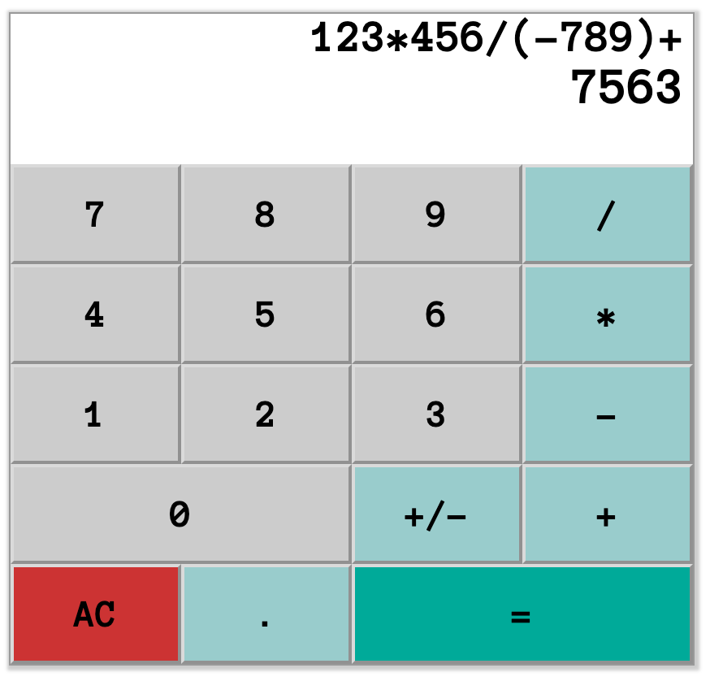
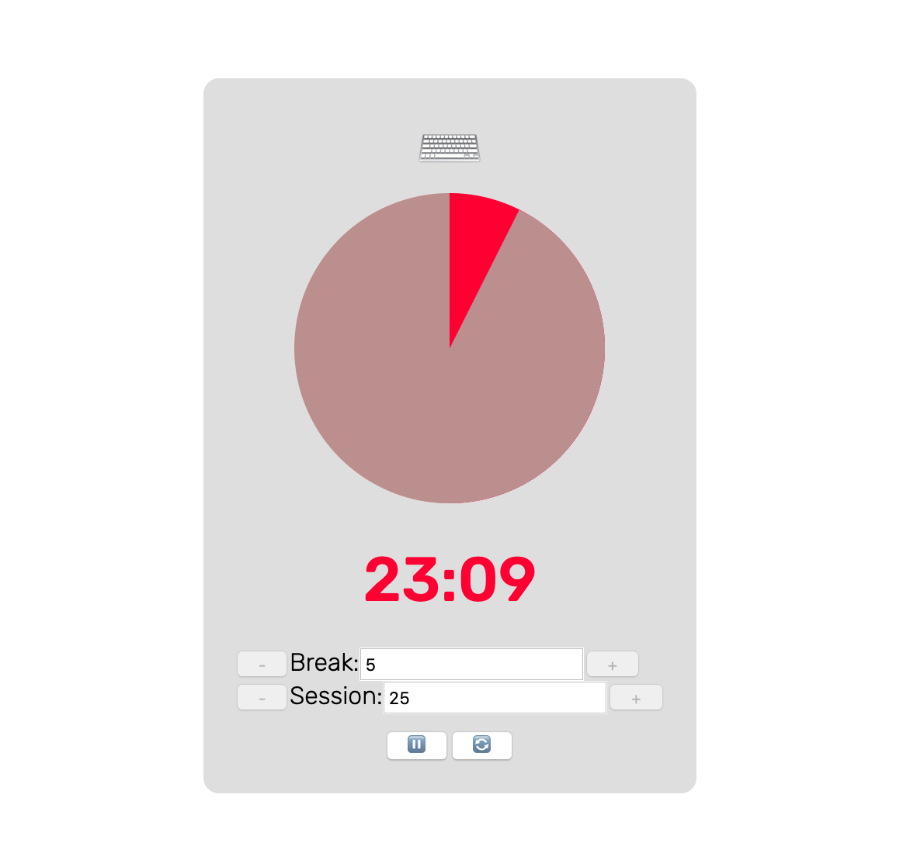

# Profile

My name is Tonghe Wang. I obtained MA in Computational Linguistics/Language Technology at Uppsala University, Sweden in 2020. This is a profile that reflects my learning track.

## Learning Projects

### React

*Calculator*

This web app is made with React and plain CSS. Source code and live demo are [available on CodePen](https://codepen.io/tonghe-wang/pen/RwovQBG). 

Specifically, the display fields and buttons are arranged using a grid. The calculator is implemented inside the `Calculator` component.

The expression to evaluate (`evalString`) and the current token (either a number or an operator) (`currentToken`) are kept in the component state. 

All clicking events are handled with `buttonClick` method. Clicked digits and the decimal point are put together as a token. Individual operators are treated as tokens too. When a token is input, it is attached to `evalString`. When the equals sign is clicked, the `evalString` is evaluated and the result is shown.

To make the if statements less confusing, a separate button is used to toggle negative and positive, leaving only subtraction to the minus button.

*Pomodoro Timer*

This web app is made with React and plain CSS. Souce code and live demo are [available on CodePen](https://codepen.io/tonghe-wang/pen/wvoLgvM).

This app consists of two components. `PomoTimer` maintains all states. All buttons, input fields, tomato and keyboard icons, and time left are nested in this component to avoid having to pass props and functions around.

An internal variable in `PomoTimer` is used to set the interval for a function that updates elapsed seconds. When the start/pause button is clicked or the timer runs out, the interval is cleared. 

Color and percentage are passed to the `Dial` component as props. This component shows the progression of a work session or a break. It is made with CSS thanks to the help of [this post on StackOverflow](https://stackoverflow.com/questions/62924550/creating-a-static-pie-chart-with-css/62924929#62924929).

*Random Haiku*

Made with React, CSS and [Font Awesome](https://fontawesome.com/). The text of the haiku is shown in component `HaikuDisplay`. A randomizer function is passed to `HaikuDisplay` from its parent component `Wrapper`. The function is triggered by the onClick event. 

Background photos are free-to-use images from Unsplash and Pexels. Due credits are given. Haikus in Japanese and Swedish are selected from from *[Aprilsnö 四月の雪](https://biblioteket.stockholm.se/titel/491325)* (Falkman et al., 2000).

### In addition:

* I finished Coursera course *[Neural Networks and Deep Learning](https://www.coursera.org/learn/neural-networks-deep-learning)* ([certificate](https://www.coursera.org/account/accomplishments/verify/FRE6BU2SZVGX)).
* I refresh my knowledge on algorithms and data structures by solving LeetCode challenges in Python and JavaScript/TypeScript  ([here are my solutions](https://github.com/t0nghe/learning/tree/master/LeetCode)).

## Courses Within Curriculum

*Course name (credits, grade)*

* Programming for Language Technologists (7.5, VG) and Advanced Programming for Language Technologists (7.5, VG)
* Master's Thesis (30, VG)
* Artificial Intelligence (5, 4)
* Current Topics in Digital Philology (5, G)
* Information Retrieval (7.5, G)
* Language Technology: R&D (15, G)
* Machine Learning in NLP (7.5, G)
* Machine Translation (5, G)
* Mathematics for Language Technologists (7.5, G)
* Natural Language Processing (15, G)
* Syntactic Parsing (7.5, G)

## Assignments and Projects Within Curriculum

**Master's Thesis**

In my [master's thesis](https://www.diva-portal.org/smash/record.jsf?pid=diva2%3A1438674&dswid=-1934), I used a Bi-LSTM architecture to tag noun phrases in Universal Dependencies corpora. Python scripts used for pre-processing the data and training the network are shared in my [thesis_code](/thesis) repository. A `readme` file is added to explain how each component works.

**Implementing Earley parser**

In this assignment in the Syntactic Parsing course, I implemented the Earley algorithm for constituency parsing. [earley_train.py](assignments/earley_train.py) and [earley_parse.py](assignments/earley_parse.py) are respectively the training and parsing components of the parser. 

The training component `earley_train.py` uses annotated syntactic trees as training data. From such training data, it learns production rules from the tree structure, terminals such as POS tags, and a vocabulary of most frequent words. The parsing component `earley_parse.py` uses the learned information to parse input sentences using the Earley algorithm. At each turn, it iterates through all states in the chart. This process is compounded by the fact that the Earley algorithm runs on cubic time when parsing.

**Crawling and indexing a website and comparing with Google**

This is an assignment for the Information Retrieval course. In [ir_crawl.py](assignments/ir_crawl.py) I scraped the official website of Uppsala kommun. The scraping process started from the homepage, unvisited pages were pushed to a stack and were ranked according to the number of incoming links. All scraped pages were converted to TREC foramt and were index using document retrieval engine [Indri](https://lemur.sourceforge.io/indri/). To compare the effectiveness of this index, measures such as P@10 (precision at 10), MAP (mean average precision) and DCG@10 (discounted cumulative gain at 10) were calculated on several query terms.

**Scraping Wikipedia** 

This is an assignment in the Advanced Programming course. In [prog_scraping.py](assignments/prog_scraping.py), I used `urllib` to fetch webpages from Wikipedia; `BeautifulSoup` to navigate DOM on a page.
